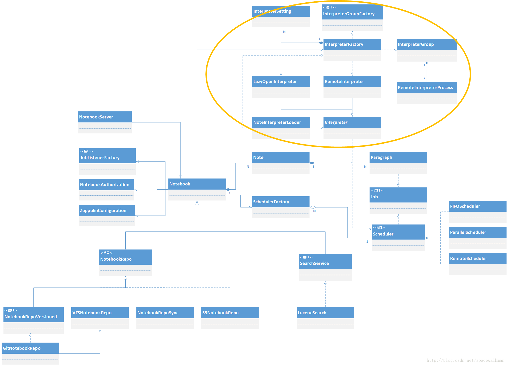
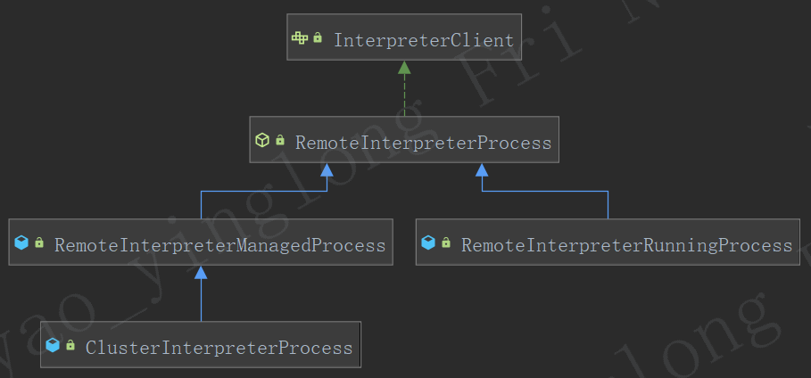
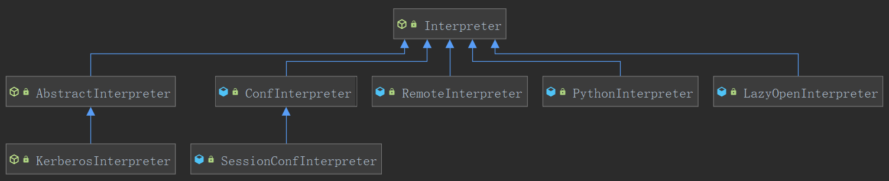
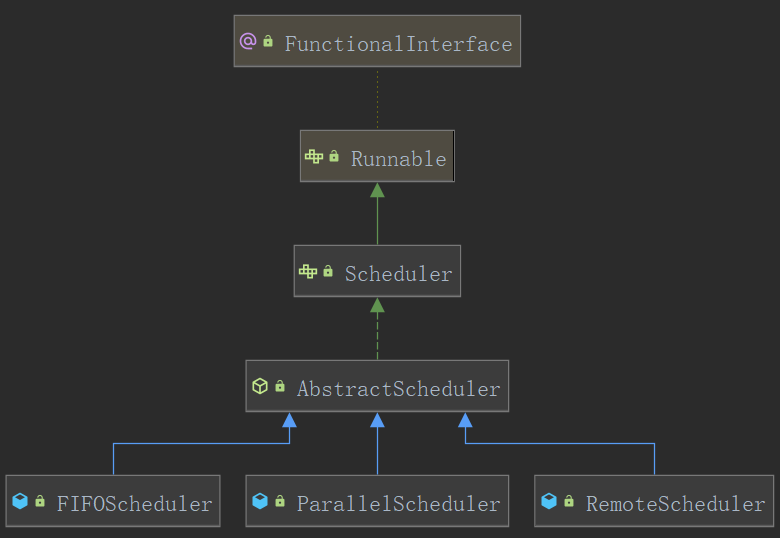

### 模块分析

`Zeppelin`的入口是`zeppelin-server`模块下`ZeppelinServer`类的Main函数，通过Jetty内嵌服务器提供WebSocket服务和Restful服务，还基于Shiro提供了权限认证和用户校验功能。

在`zeppelin-zengine`模块下，实现`Notebook`的**持久化**和**检索**功能。在`zeppelin-interpreter`模块下，通过调用`zeppelin-zengine`中的`Thrift`服务，来实现解释器的交互功能。在zeppelin-web模块下，用于脚本语言编写以及数据的可视化，使用AngularJS前端框架实现。其他模块详见下表。

| 名称                  | 说明                                                         | 实现语言  |
| --------------------- | ------------------------------------------------------------ | --------- |
| zeppelin-server       | 整个系统入口，提供服务器功能、权限认证以及用户校验等功能     | Java      |
| zeppelin-zengine      | 实现Zeppelin中Notebook的持久化和检索功能                     | Java      |
| zeppelin-interpreter  | 执行解释器                                                   | Java      |
| zeppelin-web          | 业务脚本语言编写、数据分析界面、数据可视化与结果导出         | AngularJS |
| zeppelin-display      | 让前端的AngularJS元素与后台数据进行绑定，进行数据交互        | Scala     |
| zeppelin-distribution | 用于存放编译后的二进制安装包                                 |           |
| zeppelin-examples     | 示例代码，用于测试                                           |           |
| helium-dev            | 新特性，让解释器，存储插件加入到Zeppelin中时，不需要重启Zeppelin服务 | Java      |

### distribution分析

bin目录下存储了zeppelin的启动控制脚本：

| **脚本**               | **作用**                                                     |
| ---------------------- | ------------------------------------------------------------ |
| **zeppelin-daemon.sh** | 提供以daemon形式启停org.apache.zeppelin.server.ZeppelinServer服务，并调用common.sh和function.sh设置env和classpath |
| **zeppelin.sh**        | 以foreground的形式启动ZeppelinServer                         |
| **Interpreter.sh**     | 采用单独进程启动org.apache.zeppelin.interpreter.remote.RemoteInterpreterServer服务，该脚本不会被其他脚本直接调用，实际是通过[apache common-exec](http://commons.apache.org/proper/commons-exec/)来调用的 |
| **common.sh**          | 设置zeppelin运行时需要的env和classpath，如果${ZEPPELIN_HOME}/conf/目录中存在zeppelin-env.sh，则会调用该脚本 |
| **function.sh**        | 一些公共基础函数                                             |

### ZeppelinServer

ZeppelinServer是各个组件的**组装者**，它是**系统的主入口**，职责如下：
1. 内嵌**`jetty`**服务器，支持以**`WebSocket`**和**`REST`**两种方式对外暴露系统功能
2. 创建NotebookServer实例，建立起处理WebSocket Connection和消息处理的服务端
3. 创建Notebook需要的相关依赖，如**Note持久化服务**(NotebookRepo)、**Note的全文索引服务**（SearchService），并完成向Note、Paragraph的注入。
4. Note权限配置文件的加载以及初始化
5. InterpreterFactory的初始化
6. 初始化**动态依赖加载器**(DependencyResolver)

### notebook目录

该目录是默认的notebook的**持久化存储目录**，zeppelin默认的notebook持久化实现类是`rg.apache.zeppelin.notebook.repo.VFSNotebookRepo`，该实现会以`zeppelin.notebook.dir`配置参数指定的路径来存储`notebook`，默认是`json`格式。

### Interpreter解释器模块

Zeppelin解释器的概念允许将任何语言/数据处理后端插入到Zeppelin中。**`Interpreter`**是一个抽象类，**规定了所有解释器必须实现的功能**。所有解释器都要继承这个抽象类，通过不同的具体实现，来完成不同语言的解释执行。每一个Interpreter都属于换一个InterpreterGroup，同一个InterpreterGroup的Interpreters可以相互引用。

**`RemoteInterpreterService`**由Thrift自动生成，定义了**主进程**与**独立JVM解释器进程间**的**通信协议**。

**`InterpreterGroup`**一组`Interpreter`，用于启动和停止解释器JVM的最小单元。

**`RemoteInterpreterProcess`**采用独立JVM启动interpreter的具体执行类。

**`RemoteInterpreter`**远程interpreter的本地代理

**`InterpreterSetting`**维护interpreter相关元信息，维护**`note`**与**`interpreterGroup`**的关系

**`InterpreterOption`**决定`Zeppelin`创建`interpreter`进程时的**处理方式**。

**`InterpreterFactory`**负责创建`interpreter`实例，`interpreter`配置文件的加载与持久化，`interpreterSetting`的管理。

### 记事本模块

**`Note`**由paragraph组成，权限控制、共享和持久化的最小单位。

**`Paragraph`**代码执行的最小单位，负责获取代码文本，执行过程控制及返回结果获取。

**`Notebook`**是Note的manager类，负责Note的CURD，复制、导入导出；Note和相关Interpreter配
 置和运行时映射关系的维护。

**`NotebookServer`**主要是将其他类封装，提供WebSocket等通信服务。

### 解释器执行调度器模块

此处为**生产者—消费者**模型，`Note`和`RemoteInterpreterServer`为**生产者**，`Scheduler`为**消费者**，**缓冲区**为`Scheduler`内部的`Job`队列。产品为`org.apache.zeppelin.scheduler.Job`类。

**`SchedulerFactory`**负责创建所有Scheduler，单例模式。

**`Scheduler`**调度器接口，规定了所有调度器必须实现的方法。

**`FIFOScheduler`先进先出调度器**，不支持并发执行

**`ParallelScheduler`并发调度器**，支持并发执行

**`RemoteScheduler`**远程interpreter的代理。

### 记事本存储模块

**`NotebookRepo`**持久化层顶层接口，规定了**持久化层的基本操作**。

**`AzureNotebookRepo`**数据存入`Azure`云的实现。

**`S3NotebookRepo`**数据存入`Amazon S3`文件系统的实现。

**`VFSNotebookRepo`**数据存入文件系统的实现

**`GitNotebookRepo`**使用`Git`对`Note`进行版本管理的实现

**`NotebookRepoSync`**使`note`在本地系统与远程系统之间同步的实现类。

**`ZeppelinHubRepo`**存入`ZeppelinHub`的实现类。

### 搜索服务

**`SearchService`**搜索服务接口，目前只有一个实现类`LucenceSearch`

**`LucenceSearch`**对`Note`进行**全文索引**，方便提供搜索服务。

### InterpreterClient类图

`InterpreterClient`组件用于从`zeppelin`服务器进程到`zeppelin`解释器进程进行通信的组件，且管理解释器进程的生命周期。RemoteInterpreterProcess是采用独立JVM启动repl进程的具体执行类，它采用[Apache Commons Exec](http://commons.apache.org/proper/commons-exec/)框架来根据Zeppelin主进程的”指示”启动独立进程。

该进程端口是zeppelin自动寻找操作系统中当前可用的端口，RemoteInterpreterProcess并非在构造函数中启动JVM，而是在被引用之后才启动。具体的interpterRunner脚本**`${ZEPPELIN_HOME}/bin/interpreter.sh`**。

**`RemoteInterpreterProcess`**是Thrift-Client端，而相应的**`RemoteInterpreterServer`**是Thrift-Server端。

### 用到的Interperter类图

RemoteInterpreter其本质是远程Interpreter的本地代理，是Proxy模式的典型应用，其运行在zeppelin主进程中，通过Thrift服务的Client来控制远程Interpreter的执行。

### Scheduler类图

Scheduler是基于共享缓冲区的生产者消费者模型：

- 产品：`org.apache.zeppelin.scheduler.Job`，实际是Job的**具体**实现类**`ParagraphJob`**和**`InterpretJob`**
- 生产者：往共享缓冲区中提交产品的类，zeppelin中有2个：**`Note`**和**`RemoteInterpreterServer`**。
- 消费者：Scheduler的实现类FIFOScheduler、ParallelScheduler和RemoteScheduler
- 共享缓冲区：各个Scheduler中的内部的Job队列，实际是LinkedList。

Scheduler用于**管理作业的生命周期**，包括查询、提交、取消；`Scheduler`可以在`Zeppelin Server`和`Interpreter Process`中运行，`RemoveScheduler`在Zeppelin**服务器**端运行，而`FIFOScheduler`在**解释器**进程中运行。

`RemoveScheduler`是与`RemoteInterpreterProcess`配合使用的，RemoteInterpreterProcess以独立的进程启动Interpreter，其内部同样运行了调度器，由于zeppelinServer运行在主进程中，与远程Interpreter进程不在同一个进程。RemoteScheduler的作用就**作为运行在远程Interpreter进程的远程代理**，RemoteScheduler**与ZeppelinServer运行在同一个JVM进程**中，**负责向ZeppelinServer提供远程Interpreter进程中调度器的内部运行情况**。RemoteScheduler是通过获得**`Thrift-Client`**来查询远程Job的状态。

